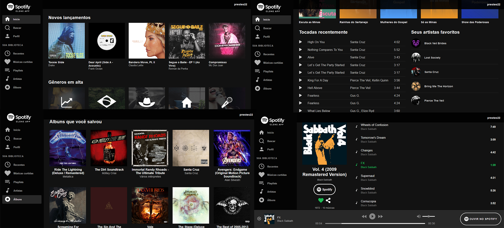

<h1 align="center">
<br>
  
<br>
<br>
Spotify clone app
</h1>

<p align="center">Um web app clone do spotify feito em ReactJS, utiliza a API do Spotify para obtenção e manipulação de dados como playlists, músicas e artistas favoritas do usuário
<br/><br/><a align="center" href="https://tsprestes-spotifycloneapp.netlify.com" target="_blank">Aplicação rodando no Netlify</a>
</p>

# 📋 Índice

- [Telas](#-Telas)
- [Sobre o projeto](#-Sobre-o-projeto)
  - [Funcionalidades](#-Funcionalidades)
- [Tecnologias utilizadas](#-Tecnologias-utilizadas)
- [Rodando o projeto](#-Rodando-o-projeto)
  - [Pré-requisitos](#-Pré-requisitos)
  - [Rodando a auth-api](#-Rodando-a-auth-api)
  - [Rodando o front-end](#-Rodando-o-front-end)

## 🎨 Telas



## 📃 Sobre o projeto

Um clone do spotify com algumas modificações visuais pequenas que em minha opinião melhoram um pouco a usabilidade.

Desenvolvido para práticar ReactJS e API Rest

Este projeto faz parte do meu potfólio pessoal, qualquer feedback sobre estrutura, código ou funcionalidades que podem melhorar o projeto serão bem vindos.

Sinta-se livre para dar um fork, ou enviar um pull request, você pode usar este projeto para estudar ou fazer melhorias!

### Funcionalidades

- Consultar as ultimas músicas escutadas por você
- Consultar as músicas e artistas mais escutadas por você em todos os tempos ou nos últimos 6 meses ou 4 semanas
- Consultar seus artistas favoritos
- Realizar buscas por artistas, álbuns ou playlists
- Consultar as músicas que você curtiu
- Consultar suas playlists
- Consultar seus artistas e álbuns salvos
- Adicionar ou remover músicas, artistas, playlists, e álbuns da sua biblioteca

## 🛠 Tecnologias utilizadas

- ⚛ **React** - Single page application
- ⚛ **React Router** - Controle de rotas
- ⚛ **Redux** - Controle de estado da track atual
- ⚛ **React redux** - Controle de estado da track atual
- 🎵 **React audio** player - Player de áudio
- 🤙 **React icons** - Ícones da aplicação
- 📡 **Axios** - Comunicação com a API do Spotify

## 🚀 Rodando o projeto

A aplicação é dividida em duas partes, my-app, que é o front-end e auth-api, que é a comunicação com a API do Spotify no login, para conseguir logar é necessário que a auth-api esteja sendo executada.

### Pré-requisitos

- Git
- NodeJS
- Yarn
- Uma conta no Spotify

### 💻 Rodando a auth-api

Clone o repositório

```bash

# Clona o repositório
git clone https://github.com/thiagosprestes/Spotify-clone-app-react.git

```

Navegue até a pasta do projeto clonado e execute os comandos abaixo

```bash

# Entra na pasta da auth-api
cd auth-api

# Instala as dependências
npm install

```
Após instalar as dependências

```bash

# Inicia a auth-api
npm run dev

```

### 🖥 Rodando o front-end

Caso já tenha clonado o repositório basta pular a primeira etapa

```bash

# Clona o repositório
git clone https://github.com/thiagosprestes/Spotify-clone-app-react.git

```

Navegue até a pasta do projeto clonado e execute os comandos abaixo

```bash

# Entra na pasta do front-end
cd my-app

# Instala as dependências
yarn

```
Após concluir a instalação das dependências, ainda no terminal da pasta do front-end execute o comando abaixo

```bash

# Inicia a aplicação
yarn start

# Após isso a aplicação pode ser utilizada acessando o endereço http://localhost:3000

```
